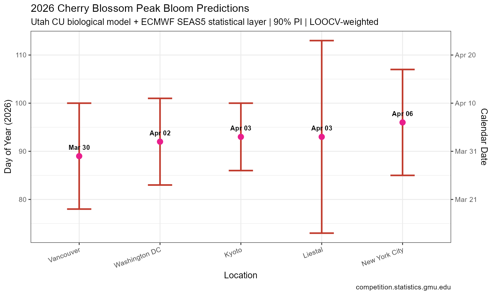
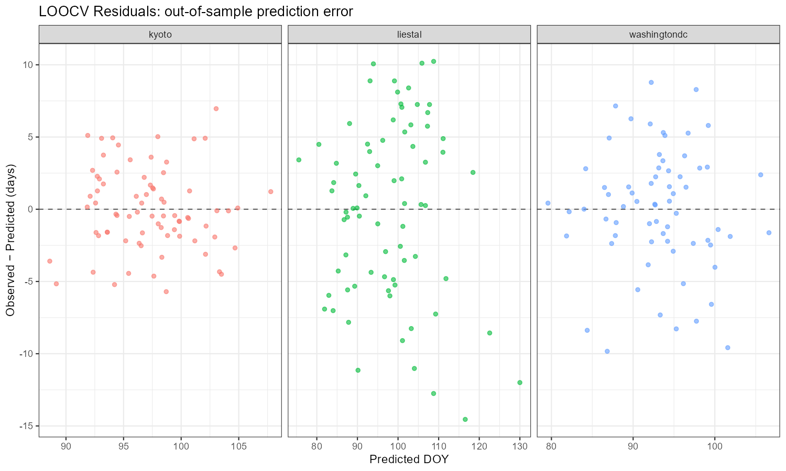

# Cherry Blossom Peak Bloom Prediction 2026

**GMU Cherry Blossom Prediction Competition** · [competition.statistics.gmu.edu](https://competition.statistics.gmu.edu)

A two-stage biological-statistical ensemble model for predicting peak cherry blossom bloom dates at five locations for the 2026 competition.

---

## Abstract

We present a two-stage ensemble model for predicting peak cherry blossom bloom dates at five locations (Washington DC, Kyoto, Liestal, Vancouver, and New York City) for the 2026 GMU Cherry Blossom Prediction Competition. Stage 1 applies a process-based dormancy-forcing framework grounded in tree phenology: dormancy release is modeled using the Utah Chill Unit (CU) method (Richardson et al., 1974), requiring accumulation of 1,200 CU over the October–March chilling window, after which heat forcing is tracked via hourly Growing Degree Hours (GDH) computed with a triangular-sigmoid response function (effective range 4–36°C). Both stages are driven by ERA5 reanalysis data (Open-Meteo archive, 1950–2026) providing over 3.3 million hourly temperature observations across all sites.

Stage 2 applies a location-specific linear regression model with predictors comprising Feb–Mar mean temperature, January mean temperature, December mean temperature (prior year), and a linear year trend to capture long-term advancement of bloom dates under climate change. The Feb–Mar 2026 temperature input is drawn from the ECMWF SEAS5 51-member seasonal ensemble forecast, with a fallback to historical means where the forecast is unavailable or implausible. Predictions from the statistical model are blended with a five-analog-year ensemble — selected by closest January temperature match — using inverse leave-one-out cross-validation (LOOCV) RMSE weighting. Vancouver, with only four years of historical bloom data, relies exclusively on the analog method.

Out-of-sample LOOCV performance is strong for Kyoto (RMSE = 2.83 days, MAE = 2.26 days, n = 75) and Washington DC (RMSE = 4.16 days, MAE = 3.23 days, n = 67), and moderate for Liestal (RMSE = 6.09 days, MAE = 5.09 days, n = 75), consistent with that site's greater interannual bloom variability. Final 2026 point predictions and 90% prediction intervals are: Washington DC April 2 (March 24 – April 11), Kyoto April 3 (March 27 – April 10), Liestal April 3 (March 14 – April 23), Vancouver March 30 (March 19 – April 10), and New York City April 6 (March 26 – April 17). New York City predictions are derived by applying a four-day phenological offset from Washington DC, reflecting the northward delay in spring warming, with an expanded uncertainty interval. All predictions reflect the continued advancement of bloom dates relative to 20th-century baselines, consistent with regional warming trends captured by the year-trend term across all fitted models.

---

## 2026 Predictions

| Location | Prediction | Lower (90% PI) | Upper (90% PI) | Method |
|---|---|---|---|---|
| Vancouver | Mar 30 | Mar 19 | Apr 10 | Analog ensemble |
| Washington DC | Apr 02 | Mar 24 | Apr 11 | Statistical model |
| Kyoto | Apr 03 | Mar 27 | Apr 10 | Statistical model |
| Liestal | Apr 03 | Mar 14 | Apr 23 | Statistical model |
| New York City | Apr 06 | Mar 26 | Apr 17 | DC offset |



---

## Model Architecture

```
ERA5 Hourly Temperatures (1950–2026)
          │
          ▼
┌─────────────────────────┐
│  STAGE 1: BIOLOGICAL    │
│  Utah Chill Unit Model  │
│  Requirement: 1,200 CU  │
│  (Richardson et al. '74)│
└────────────┬────────────┘
             │ Dormancy release date
             ▼
┌─────────────────────────┐
│  STAGE 1B: FORCING      │
│  Hourly GDH Sigmoid     │
│  Effective range 4–36°C │
└────────────┬────────────┘
             │ GDH threshold per location
             ▼
┌─────────────────────────┐     ┌──────────────────────┐
│  STAGE 2: STATISTICAL   │     │  ANALOG ENSEMBLE     │
│  Linear Regression      │     │  Top-5 Jan-temp      │
│  + ECMWF SEAS5 forecast │     │  matched years       │
│  LOOCV validated        │     │                      │
└────────────┬────────────┘     └──────────┬───────────┘
             │                             │
             └──────────┬──────────────────┘
                        │ Inverse-RMSE weighted blend
                        ▼
               Final Prediction + 90% PI
```

---

## Model Performance (LOOCV)

| Location | RMSE (days) | MAE (days) | n (years) |
|---|---|---|---|
| Kyoto | 2.83 | 2.26 | 75 |
| Washington DC | 4.16 | 3.23 | 67 |
| Liestal | 6.09 | 5.09 | 75 |
| Vancouver | — | — | 4 (analog only) |



---

## Data Sources

| Source | Description | Coverage |
|---|---|---|
| [GMU GitHub](https://github.com/GMU-CherryBlossomCompetition/peak-bloom-prediction) | Historical bloom dates | Kyoto (~837 yrs), DC (105 yrs), Liestal (132 yrs), Vancouver (4 yrs) |
| [Open-Meteo ERA5 Archive](https://open-meteo.com) | Hourly 2m temperature reanalysis | 1950–2026, all 5 locations |
| [ECMWF SEAS5 via Open-Meteo](https://open-meteo.com) | Seasonal forecast, Feb–Mar 2026 | 51-member ensemble |

---

## Methods Detail

### Stage 1A — Utah Chill Unit Model
Dormancy depth is tracked hourly using the Richardson et al. (1974) chill unit scale, which assigns weights based on temperature ranges:

| Temperature Range | Chill Units/hour |
|---|---|
| ≤ 1.4°C | 0.0 |
| 1.4–2.4°C | 0.5 |
| 2.4–9.1°C | 1.0 |
| 9.1–12.4°C | 0.5 |
| 12.4–15.9°C | 0.0 |
| 15.9–18.0°C | −0.5 |
| > 18.0°C | −1.0 |

Accumulation begins October 1. Dormancy is considered broken when cumulative CU ≥ 1,200 (standard requirement for *Prunus × yedoensis* Yoshino cherry).

### Stage 1B — Hourly GDH Forcing
Post-dormancy heat accumulation uses a triangular-sigmoid GDH function:

```
GDH(T) = max(0, T − 4) × max(0, 1 − max(0, T − 36) / 11)
```

Effective forcing range: 4–36°C, peak response ~16–24°C.

### Stage 2 — Statistical Correction
Location-specific OLS regression:

```
bloom_doy ~ feb_mar_tavg + jan_tavg + dec_tavg + year_centered
```

- **feb_mar_tavg**: Feb–Mar mean temperature (SEAS5 forecast for 2026)
- **jan_tavg**: January mean temperature (ERA5 observed for Jan 2026)
- **dec_tavg**: December mean temperature of prior year (ERA5 observed Dec 2025)
- **year_centered**: Year − 1990 (captures long-term trend)

Model R²: Kyoto 0.691, Liestal 0.762, Washington DC 0.665 (all p < 10⁻¹³).

### Ensemble Weighting
Point estimates blend statistical model and analog ensemble using inverse-LOOCV-RMSE weights:

```
prediction = (pred_model / RMSE_model + pred_analog / RMSE_analog) /
             (1/RMSE_model + 1/RMSE_analog)
```

Prediction intervals use a weighted blend of the model's 90% PI half-width and 1.645 × analog SD.

---

## Repository Structure

```
.
├── README.md
├── predictions.csv          # Final submission file
├── bloom_model.R            # Full modelling pipeline
├── bloom_predictions_2026.png
└── loocv_residuals.png
```

---

## Reproducing the Analysis

### Requirements

```r
install.packages(c("tidyverse", "lubridate", "httr", "jsonlite", "broom", "patchwork"))
```

### Run

```r
source("bloom_model.R")
```

The script will:
1. Download historical bloom dates from the GMU GitHub repository
2. Fetch ERA5 hourly temperature data from Open-Meteo (~2–3 min)
3. Fetch the ECMWF SEAS5 seasonal forecast
4. Run the Utah CU + GDH biological model
5. Fit and LOOCV-validate location-specific regression models
6. Output `predictions.csv` and diagnostic plots

> **Note:** Requires an internet connection. ERA5 data fetch covers 1950–2026 across 5 locations (~3.3M rows) and takes approximately 2–3 minutes.

---

## Submission Format

```
year, location,     prediction, lower, upper, interval
2026, kyoto,               93,    86,   100,       90
2026, liestal,             93,    73,   113,       90
2026, newyorkcity,         96,    85,   107,       90
2026, vancouver,           89,    78,   100,       90
2026, washingtondc,        92,    83,   101,       90
```

---

## References

- Richardson, E. A., Seeley, S. D., & Walker, D. R. (1974). A model for estimating the completion of rest for Redhaven and Elberta peach trees. *HortScience*, 9(4), 331–332.
- Luedeling, E., Zhang, M., & Girvetz, E. H. (2009). Climatic changes lead to declining winter chill for fruit and nut trees in California during 1950–2099. *PLOS ONE*, 4(7), e6166.
- Zohner, C. M., & Renner, S. S. (2014). Common garden comparison of the leaf-out phenology of woody species from different native climates. *Ecology Letters*, 17(9), 1083–1092.

---

## 🏆 Competition

[GMU Cherry Blossom Peak Bloom Prediction Competition](https://competition.statistics.gmu.edu) · Deadline: February 28, 2026
